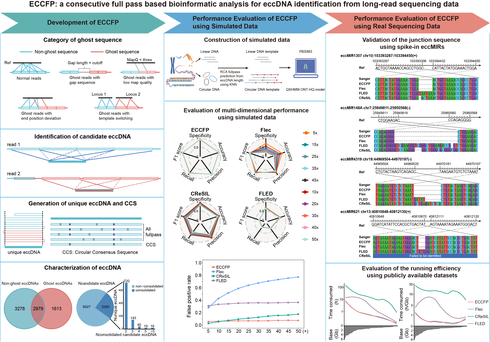

# ECCFP - EccDNA Caller based on Consecutive Full Pass
A software package for identifying eccDNAs in the ONT sequencing data of RCA-amplified eccDNA
## Introduction
A new bioinformatics pipeline called ECCFP has been developed to improve the detection of extrachromosomal circular DNA (eccDNA) from long-read sequencing data. ECCFP uses all consecutive full passes from individual reads for candidate eccDNA identification and consolidates candidate eccDNAs to generate accurate unique eccDNA. To thoroughly evaluate the performance of ECCFP, 6 simulated datasets, 2 real sequencing datasets with spiked-in artificial synthesized eccDNAs and 29 publicly available real sequencing datasets, were applied. The results demonstrate that ECCFP markedly reduces the false positive rate, significantly increases the number of unique eccDNAs detection, achieves higher accuracy in identifying junction positions and circular consensus sequences, and also shortens the runtime, when compared to other three eccDNA analysis pipelines.  
[](https://doi.org/10.1002/imo2.70080)
[](https://doi.org/10.21769/BioProtoc.5636)  
||
|:---------------------------------------:|
#### Reference
ECCFP is optimized from the [Flec](https://github.com/icebert/eccDNA_RCA_nanopore.git) software.
- [eccDNA_RCA_nanopore](https://github.com/icebert/eccDNA_RCA_nanopore.git)
- [minimap2](https://github.com/lh3/minimap2/)
#### Dependency (python packages)
- [numpy](https://numpy.org/)
- [pandas](https://pandas.pydata.org/)
- [pyfaidx](https://pypi.org/project/pyfaidx/)
- [pyfastx](https://pypi.org/project/pyfastx/)
- [Biopython](https://biopython.org)
## Installation
```
git clone https://github.com/WSG-Lab/ECCFP.git
cd ECCFP
conda env create --file environment.yml -y
conda activate ECCFP
pip install -e .

# Verify installation and display help message
eccfp --help
```
## Usage
#### simple usage
```
eccfp --fastq input.fastq --paf mapping.paf --reference ref.fa -o output
```
#### Parameter
```
usage: eccfp [options]

options:
  -h, --help            show this help message and exit

  Generate candidate eccDNA from rolling circle reads:

  --fastq FASTQ         input reads in fastq format
  --paf PAF             input alignments in PAF format
  --reference REFERENCE
                        reference genome sequences in fasta format
  --output OUTPUT, -o OUTPUT
                        output folder, the default is the current folder
  --maxOffset MAXOFFSET
                        maximum offset of start/end positions between two sub-reads to be considered as mapping to the same location, default is 20
  --minMapQual MINMAPQUAL
                        minimum mapping quality of sub-reads, default is 30

  Get accurate eccDNA location from candidate eccDNA:

  --fluctuate FLUCTUATE
                        maximum offset between the candidate eccDNA and the candidate eccDNA in a group, default is 20bp
  --nf NF               minimum number of fullpass to support candidate eccDNA, default is 2
  --cov COV             minimum fullpass used for merging a set of candidate eccDNA, default is 1
  --nc NC               minimum number of candidate eccDNA required to merge overlapped candidate eccDNAs, default is 2

  Generate consensus sequences and variants:

  --minDP MINDP         minimum depth to call variants, default is 4
  --minAF MINAF         minimum alternative allele frequency to call variants, default is 0.75

```
#### Example
```
cd example
minimap2 -cx map-ont ref.fa example.fastq --secondary=no -t 8 -o mapping.paf
eccfp --fastq example.fastq --paf mapping.paf --reference ref.fa -o output
```
## Output
Five files are generated following the completion of the pipeline: unit.txt and candidate_consolidated.txt(intermediate files), final_eccDNA.txt, consensus_sequence.fasta, and variant.txt (result files).   
|<div style="width: 150pt">file|<div style="width: 300pt">details|
|----|-------|  
|unit.txt|full pass alignment details for all candidate eccDNAs detected in reads|
|candidate_consolidated.txt|the consolidating steps used to derive accurate eccDNAs from the candidate eccDNAs|
|final_eccDNA.txt|accurate eccDNA information|
|consensus_sequence.fasta|the consensus sequences of accurate eccDNAs|
|variants.txt|variant profiles specific to these accurate eccDNAs|

###### Example final_eccDNA.txt file
|eccDNApos|Nfullpass|Nfragments|Nreads|refLength|seqLength|
|---------|---------|----------|------|---------|---------|
|chr16:757924-758274(+)|4|1|1|351|350|
|chr1:21828265-21828439(+)\|chr7:132167689-132167880(+)|24|2|2|367|367|

|<div style="width: 150pt">|<div style="width: 300pt">description|
|---------|---------------|
|eccDNApos|eccDNA position|
|Nfullpass|Number of consecutive full pass for this eccDNA covered by all reads|
|Nfragments|Number of fragment that form this eccDNA|
|Nreads|Number of reads identified for the eccDNA|
|refLength|The length of reference genome that this eccDNA |
|seqLength|The length of consensus sequence that this eccDNA |

###### variants.txt file
|<div style="width: 150pt">|<div style="width: 300pt">description|
|-------|-------|
|col1|chromsome|
|col2|position in the reference genome|
|col3|reference base|
|col4|variant|
|col5|supportive coverage depth|
|col6|total coverage depth|
|col7|type|
|col8|eccDNApos|

## Citation
- **Primary publication (iMetaOmics, 2026):** 
> Li, W., Miao, B., Zhang, J., Zeng, Q., Zhang, T., Wu, Z., Song, Y., Li, M., Guo, L., Luo, J., Xu, J., Liu, T., Chen, S., Gu, J. and Wan, S. (2026), ECCFP: A consecutive full pass-based bioinformatic analysis for eccDNA identification from long-read sequencing data. *iMetaOmics* e70080. https://doi.org/10.1002/imo2.70080
- **Protocol (Bio-protocol, 2026):**
> Li, W., Miao, B. and Wan, S. (2026). A Bioinformatics Workflow to Identify eccDNA Using ECCFP From Long-Read Nanopore Sequencing Data. *Bio-protocol* 16(6): e5636. DOI: 10.21769/BioProtoc.5636.
